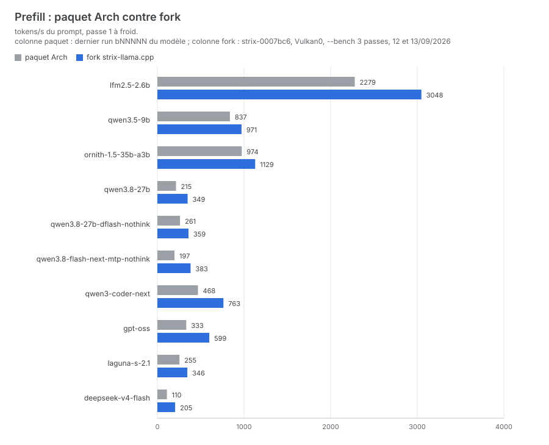
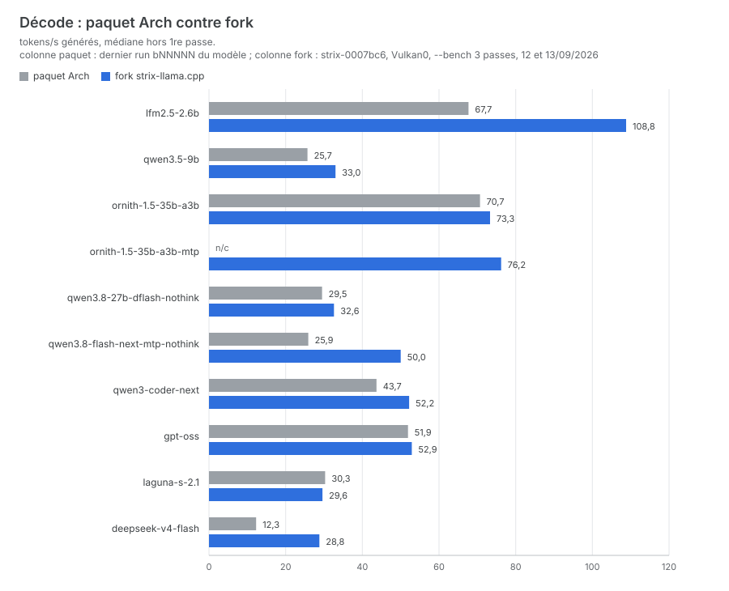
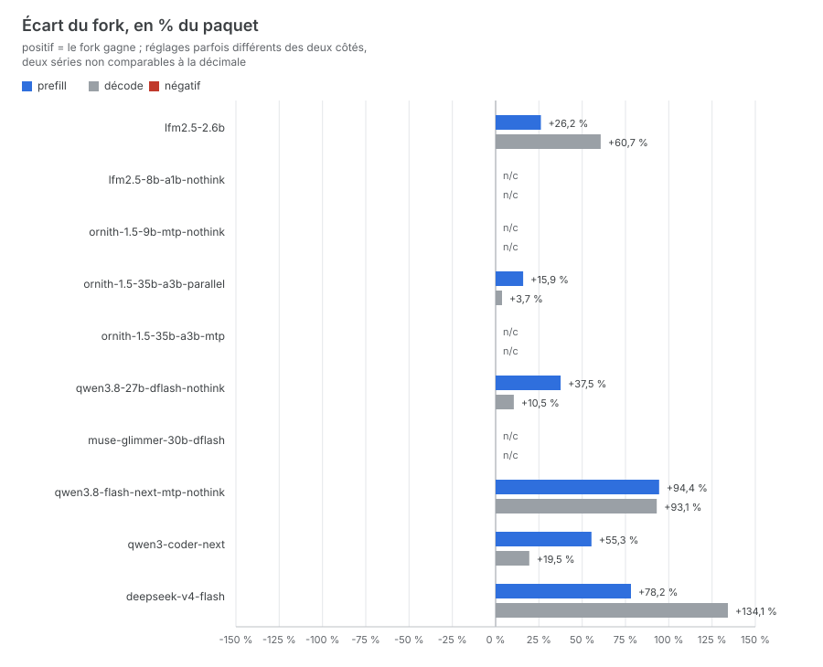

# LLM Setup

LLM Setup pilote un `llama-server` en router mode natif sur une machine Strix Halo
(bigchuck : Ryzen AI Max+ 395, 124 Go unifiés, CachyOS/Arch), avec un seul point
d'entrée, `./setup-llm.sh`, et un moteur : le fork
[halo-box/strix-llama.cpp](https://github.com/halo-box/strix-llama.cpp),
construit localement (depuis le 12/09/2026, le paquet Arch `llama-cpp` ne sert
plus que de secours).

Ce qu'il gère :

- téléchargement des GGUF depuis Hugging Face (`hf`, mises à jour par etags) ;
- génération de `~/models/models.ini` : les réglages de chaque modèle vivent
  dans `lib/models.sh` avec leurs justifications en commentaire ;
- préchargement always-on ou chargement à la demande (LRU) ;
- mesure des perfs par l'API du serveur (`--bench`, `--bench-devices`) et
  réglage de la spéculation par mesure : drafter (`spec-draft-n-max`,
  calibration α) et n-gram (`spec-ngram-map-k-size-m`) ;
- installation et suivi du moteur, service systemd user.

Les backends ggml (Vulkan par défaut, ROCm/HIP optionnel) sont des paquets
Arch séparés. Tout est piloté par des fichiers de conf locaux à côté du script
(non versionnés, propres à la machine). Le `models.ini` est généré, jamais édité.

Historique et campagnes de mesure détaillées : [docs/HISTORIQUE.md](docs/HISTORIQUE.md).

## Prérequis

- Arch/CachyOS, `paru`, bash 4.3 ou plus, python3 (stdlib seule), curl.
- **docker et son démon activé au boot** (`systemctl enable --now docker`) :
  le service llama-server est un **conteneur**, décrit par un
  `docker-compose.yml` généré dans `~/models`. Sans démon actif au boot, le
  service ne revient pas après un redémarrage de la machine - c'est `docker`
  qui remplace le `loginctl enable-linger` d'avant.
- `hf` (python-huggingface-hub, python-hf-xet). `gum` optionnel (menus).
- Paquets llama.cpp : `llama-cpp`, plus les backends ggml splittés :
  `ggml-cpu` et `ggml-vulkan` (obligatoires, installés par `--setup`).
- Pour ROCm0 : `ggml-hip` et le runtime ROCm (`rocm-hip-runtime`, `hipblas`,
  `rocblas`, `hipblaslt`). Le runtime seul ne suffit pas. Contrôle :
  `rocminfo | grep gfx` doit donner `gfx1151`.

## Installation

```bash
./setup-llm.sh --setup        # dépendances, GGUF, préchargement, models.ini + docker-compose.yml
./setup-llm.sh --image-build  # moteur conteneurisé (40 à 60 min à froid)
./setup-llm.sh --start        # monte le conteneur et ATTEND que /health réponde
```

Le service ensuite :

```bash
./setup-llm.sh --status            # docker compose ps + réponse de /health
./setup-llm.sh --logs -f           # journaux du conteneur
./setup-llm.sh --restart           # stop puis start (compose régénéré, conteneur recréé)
./setup-llm.sh --stop
```

À la main, sans passer par le dépôt (même conteneur, mêmes journaux) :

```bash
cd ~/models && docker compose ps
cd ~/models && docker compose logs -f
```

Le `docker-compose.yml` de `~/models` est **généré** (`lib/compose.sh`), au même
titre que `models.ini` : il n'est pas versionné, il n'est pas à éditer, et
`--start` le réécrit à chaque démarrage. Il porte toutes les valeurs en clair
(pas de `${VAR}`, pas de `.env`), y compris `seccomp=unconfined` - **exigé par
ROCr**, dont les ioctl du KFD sortent du profil seccomp par défaut de docker.
C'est le seul assouplissement, et il est compensé : `cap_drop: [ALL]`,
`no-new-privileges`, aucun `privileged`, aucun accès à `docker.sock`, `~/models`
monté en lecture seule et un seul volume inscriptible hors du parc
(`~/.local/state/llm-setup/cache`).

En fin de `--setup`, si le fork n'est pas le moteur résolu, son installation est
**proposée** (défaut oui, `--setup-fork` derrière ; en entrée non interactive
rien n'est fait et la commande est rappelée) : les réglages du parc en dépendent.

## Moteur : fork strix-llama.cpp

Le fork apporte les clés de réglage dont le parc dépend (n-gram sur disque,
budget de réflexion, drafter externe, MTP de Qwen3.8-Flash-Next) et gagne le
prefill sur tout le parc. Il est construit dans `~/llm/strix-llama.cpp` et
exposé par quatre liens (`llama-server`, `llama-bench`, `llama-cli`,
`llama-quantize`) dans `~/.local/bin`.

> Depuis la conteneurisation du service, **le fork n'est plus le moteur servi** :
> c'est l'image (section suivante). Il reste le moteur des outils **hors
> service** - `llama-bench` des courbes de batch (`--spec-ngram-tune`,
> `tools/bench-spec-batch.sh`, `tools/bench-depth.sh`) et le `llama-server`
> jetable de `tools/spec-isolate.sh` - et le filet de retour arrière tant que la
> migration n'est pas terminée.

```bash
./setup-llm.sh --setup-fork   # installe ou réinstalle (clone si besoin, build, liens)
./setup-llm.sh --update-fork  # suivi d'amont du fork déjà en place
./setup-llm.sh --list-devices # quel binaire répond, et sa version
./setup-llm.sh --unset-fork   # retire les liens : retour au paquet Arch
```

**Épingler un commit.** Une resynchronisation d'amont peut faire régresser un
modèle sans rien casser ailleurs (13/09/2026 : le passage à `6548035`, sync
b10917, fait tomber le prefill batché de Qwen3.8-27B de 69 à 58 t/s en pp7 et
de 79 à 52 en pp8, alors que `0007bc6` était bon). On revient alors à un commit
connu et on y reste tant que l'amont n'est pas corrigé :

```bash
./setup-llm.sh --setup-fork 0007bc6 "sync b10917 : régression pp7/pp8 sur Qwen3.8-27B"
./setup-llm.sh --setup-fork   # sans argument : dépingle et reprend la branche
```

L'argument est un commit, un tag ou une branche : `git fetch`, puis `checkout`
détaché (commit, tag) ou suivi de branche (`checkout` + `pull --ff-only`),
rebuild et liens comme d'habitude. L'épinglage est écrit dans `fork.conf`
(local, non versionné, `pin = <commit>` et `raison = <texte>` facultative, aussi
prise dans `$FORK_PIN_REASON`). Tant qu'il tient, `--update-fork` ne tire plus
rien : il annonce le commit épinglé et sa raison, montre quand même le changelog
en attente en amont (pour voir passer le correctif) et rappelle la commande de
reprise. `--list-devices` et la fin de `--setup` affichent l'épinglage.

`--update-fork` est la commande de suivi au quotidien, à lancer juste après un
`--update` : elle refuse d'agir si le fork n'est pas cloné ou si les liens ne
viennent pas de lui, refuse un arbre sale, `git fetch` seulement, affiche le
**changelog** trié (les commits propres au fork ; les commits llama.cpp d'amont
réduits à un compte) puis **demande confirmation** avant de tirer et
reconstruire : sans « o », rien n'est tiré (`FORK_UPDATE_YES=1` vaut
confirmation, entrée non interactive = rien). Ni `--setup-fork` ni
`--update-fork` ne redémarre le service ni ne lance de mesure.

Deux pièges. Les binaires portent un RUNPATH absolu vers leur dossier `build` :
déplacer `~/llm/strix-llama.cpp` impose un rebuild (`--setup-fork`), jamais un
`mv`. Et le routeur refuse toute clé ini inconnue sans démarrer du tout : les
clés propres au fork (`ngram-on-disk`, `reasoning-budget-*`,
`spec-draft-adaptive`, `spec-prefill*` — liste `FORK_ONLY_KEYS` dans
`lib/fork.sh`) font échouer le paquet Arch, et `--start` refuse de lancer un
moteur upstream sur un tel ini, en nommant le modèle et la clé. Pour revenir au
paquet Arch : retirer ces clés de `lib/models.sh`, puis `--preload` (régénère le
ini) avant le restart.

Étiquette des mesures : elle vient des `LABEL` de l'image servie et vaut
`strix-<engine7>+r<rocm7>` (colonne build des journaux). Chaque bump de l'image
ouvre une **nouvelle série** ; les séries ne se comparent pas
(cf. ARCHITECTURE.md, comparabilité des journaux).

## Moteur conteneurisé (moteur du service)

Le dépôt sait aussi construire un **second moteur**, en image docker : ROCm 10.0
gfx1151, un runtime ROCr/HIP retained-PM4 recompilé, et
`halo-box/strix-llama.cpp` construit en HIP seul. Le Dockerfile est vendorisé
dans `runtime/` depuis la PR 133 de `kyuz0/amd-strix-halo-toolboxes` ;
provenance, écarts exacts et procédure de resynchronisation dans
[`runtime/AMONT.md`](runtime/AMONT.md).

> ⚠ **C'est le moteur du service.** `--image-build`, `--image-update` et
> `--image-status` construisent et inventorient des images sans rien redémarrer :
> une image neuve n'est servie qu'au prochain `./setup-llm.sh --restart`, qui
> régénère le compose et recrée le conteneur.

```bash
./setup-llm.sh --image-status   # ce qui est demandé, ce qui est en place
./setup-llm.sh --image-build    # construit et vérifie (40 à 60 min à froid)
./setup-llm.sh --image-update   # ce qui a bougé en amont, sans rien changer
```

Ce qui tient l'ensemble :

- `runtime/image.conf` (**versionné**) porte les dépôts, les branches et les
  **révisions épinglées**. Son historique git **est** le journal des révisions,
  et le retour arrière passe par lui (`git revert`, ou
  `--image-update <engine-rev> <rocm-rev>`, puis `--image-build`).
- **Un seul tag**, `llm-rocm-strix:latest` : une image se reconstruit en
  quelques minutes, on n'en collectionne pas. Ce qu'elle contient se lit dans
  ses étiquettes (`llm-setup.engine_rev`, `llm-setup.rocm_rev`,
  `llm-setup.build_date`), dans `/opt/strix/versions.txt` et dans
  `logs/images.tsv` - et c'est de là que vient l'étiquette de toutes les
  mesures (`_llama_build`, forme `strix-<engine7>+r<rocm7>`).
- L'image ne contient **que le moteur et son runtime** : pas de modèle, pas de
  configuration, pas d'état. `~/models` est monté en lecture seule au même
  chemin absolu au moment de lancer un binaire.
- Le ménage d'après-build ne supprime que des images **sans tag portant notre
  étiquette** — jamais de `docker system prune`, jamais `docker image prune -a`.

Comme pour le fork, **une image = une série de mesures** : un changement de
révision n'est pas comparable à ce qui précède, d'où le refus d'`--image-update`
d'avancer sans accord explicite.

## Sous-commandes

| Commande | Rôle |
|---|---|
| `--setup` | Installe les dépendances, propose ROCm, télécharge les GGUF manquants, sélectionne le préchargement, génère le ini, propose le fork s'il n'est pas le moteur |
| `--update [modèle]` | Comme `--setup`, mais laisse `hf` comparer les etags : seul ce qui a bougé est retéléchargé |
| `--cleanup [--yes]` | Supprime les dossiers et GGUF orphelins (dry-run par défaut) |
| `--preload` | Re-sélectionne les modèles always-on et régénère le ini |
| `--bench [modèle\|all] [n]` | Mesure le serveur tel qu'il tourne : prefill, décode médian, acceptance MTP, tableau récapitulatif. N'écrit rien ; avant de charger un modèle, décharge les plus gros modèles résidents si la RAM ne suffit pas (`BENCH_NO_UNLOAD=1` pour désactiver) |
| `--bench-devices [modèle] [devices] [n]` | Compare les devices d'un modèle (défaut Vulkan0,ROCm0) : bench avec restart par device, verdict par temps de tour simulé, vainqueur écrit dans `bench-devices.conf` (détail dans ARCHITECTURE.md) |
| `--bench-parallel [modèle] [n] [passes]` | Débit sous `n` requêtes simultanées (défaut : le `parallel` du modèle) : agrégé et décode par requête contre 1 requête ; montre ce que vaut `parallel = N` et la file d'attente au-delà |
| `--bench-cache [modèle]` | Efficacité du cache de prompt sur le pattern agentic (contexte froid, tour suivant, édition au premier tiers, requête identique) : part du prompt servie du cache et prefill à chaque fois ; c'est la mesure de `cache-ram` / `ctx-checkpoints` / `cache-reuse` |
| `--bench-sanity [modèle\|all]` | Recopie exacte d'un code (`prompts/bench-sanity.txt`, trivial pour ne tester que le backend) : un device qui répond faux est exclu de `--bench-devices`, en plus du garde-fou anti-charabia |
| `--bench-agentic [modèle] [passes] [N]` | Une vraie boucle de tool calls : pi (conteneur jetable, `bench-agentic/`) joue un appel froid (prompt système) puis N passes de 5 scénarios en direct sur llama-server ; par scénario PASS/passes et médianes (temps mur, prompt et part du cache, générés, prefill et décode t/s réels). 3e argument `N` > 1 : chaque passe joue la suite seule puis à `N` boucles pi **simultanées** (orchestrateur + sous-agents), avec le facteur de débit de tâches et le décode agrégé |
| `--bench-load [modèle\|all]` | Temps de chargement + premier token après restart, puis TTFT à chaud : ce que coûte un modèle à la demande (base pour `preload.conf` et `--models-max`) |
| `--setup-fork [commit] [raison]` | Installe ou met à jour le moteur : fork [halo-box/strix-llama.cpp](https://github.com/halo-box/strix-llama.cpp), build cmake Vulkan et liens dans `~/.local/bin`. Avec un commit (ou tag, ou branche) : épingle le moteur dessus et l'écrit dans `fork.conf` ; sans argument, dépingle et reprend la branche (voir « Moteur ») |
| `--update-fork` | Suivi d'amont du moteur, juste après un `--update` : `git fetch`, changelog des commits reçus et confirmation, puis mise à jour du fork **déjà installé** (`git pull --ff-only`, rebuild et liens), s'arrête si rien n'a bougé, ne redémarre rien et ne mesure rien. Si le moteur est épinglé (`fork.conf`), ne tire rien et se contente du changelog en attente (voir « Moteur ») |
| `--unset-fork` | Retire les liens du fork : retour au paquet Arch pour les outils **hors service** (le service tourne sur l'image) |
| `--image-build [--no-cache]` | Construit l'image du moteur **conteneurisé** (`runtime/`) sur les révisions de `runtime/image.conf`, sous un tag temporaire ; vérifie `/opt/strix/versions.txt` et les quatre binaires, puis seulement promeut en `llm-rocm-strix:latest` et supprime les images sans tag issues de nos builds. Un build raté laisse l'image en place intacte. **C'est le moteur du service** : une image neuve n'est servie qu'au prochain `--restart` |
| `--image-update [engine-rev] [rocm-rev]` | Suivi d'amont de l'image : sans argument, montre l'écart avec les sommets des deux branches et s'arrête (`IMAGE_UPDATE_YES=1` vaut accord, comme `FORK_UPDATE_YES`) ; avec accord ou révisions données, réécrit `image.conf` puis construit. C'est aussi le retour arrière du moteur conteneurisé |
| `--image-status` | Révisions demandées, image `:latest` en place avec ses étiquettes, verdict de conformité, taille, images sans tag restantes et place du cache de build. Ne construit ni ne purge rien |
| `--list-devices` | Moteur résolu (paquet Arch ou fork) avec sa version, backends ggml installés et devices exposés, croisés avec `bench-devices.conf` |
| `--spec-test [modèle] [n] [prompt]` | Décode réel via l'API (spéculation incluse), journalise, calibre et persiste le n-max dès 2 valeurs mesurées. Prompt par défaut `spec-test.txt` ; un autre prompt est journalisé à part et ne calibre pas |
| `--spec-tune [modèle] [k1,k2,..] [n]` | Boucle automatique sur plusieurs n-max avec restart entre chaque, retient le meilleur mesuré |
| `--spec-ab <modèle> <n> <prompt\|-> <variante>...` | A/B de réglages spéculatifs sur mesure réelle : chaque variante (`clé=val;clé=val` sur le corps ini, ou `base`) est appliquée, le service redémarré, `--spec-test` mesuré ; bilan comparé, rien d'écrit dans les conf |
| `--spec-ngram-tune [modèle] [n] [prompt]` | Règle la longueur de draft n-gram (`spec-ngram-map-k-size-m`) : courbe `t_forward(batch)` pour localiser la marche de noyau ggml, puis arbitrage des candidats sur mesure réelle (prompt de refactor par défaut) |
| `--start` | Démarre le service : `docker-compose.yml` régénéré dans `~/models`, conteneur recréé, puis **attente de `/health`** - la commande ne rend la main que quand le routeur répond sur le port 8009 |
| `--stop` | Arrête le conteneur (SIGINT, jusqu'à 180 s : le déchargement des préchargés est long) |
| `--restart` | `--stop` puis `--start`. Jamais `docker compose restart`, qui garderait l'ancienne image, l'ancienne ligne de commande et l'ancien `--models-max` |
| `--status` | `docker compose ps` et réponse de `/health` |
| `--logs [-f] [--tail N]` | Journaux du conteneur |
| `--migrate-off-systemd` | **Temporaire** : débranche l'ancienne unité systemd user (stop, disable, suppression, `daemon-reload`), vérifie que le port 8009 est libre et signale les liens `~/.local/bin/llama-*` restants. Idempotente ; à jouer une fois avant le premier `--start` |
| `--help` | Aide, liste des modèles et des clés de téléchargement |

## Workflow typique

```bash
./setup-llm.sh --setup                # première mise en place
./setup-llm.sh --update               # 1. modèles (etags)
./setup-llm.sh --image-update         # 2. moteur du service (image, si bump accepté)
./setup-llm.sh --restart              # 3. appliquer
./setup-llm.sh --bench all            # 4. perfs de tous les modèles présents : régressions
./setup-llm.sh --bench-devices        # Vulkan ou ROCm pour un modèle ?
./setup-llm.sh --spec-tune            # règle spec-draft-n-max d'un modèle à drafter
./setup-llm.sh --spec-ngram-tune      # règle la longueur de draft n-gram
./setup-llm.sh --spec-ab <m> 4 - base "spec-ngram-map-k-min-hits=1"   # compare des réglages
./setup-llm.sh --bench-parallel <m>   # ce que vaut parallel = N
./setup-llm.sh --bench-cache <m>      # part du prompt repayée à chaque tour (agentic)
./setup-llm.sh --bench-load <m>       # coût d'une bascule LRU
./setup-llm.sh --bench-agentic <m> 3  # vraie boucle de tool calls (pi), PASS/FAIL et t/s réels
./setup-llm.sh --bench-agentic <m> 2 3  # les mêmes à 3 boucles simultanées : débit de tâches
```

## Mesurer

Le script ne mesure jamais les GGUF directement : tout passe par l'API du
serveur tel qu'il tourne (`/v1/chat/completions`), donc avec les réglages réels
du `models.ini` (quantisation du cache KV, flash-attn, spéculation incluse). Un
chiffre de bench est un chiffre de production, pas un `llama-bench` sur les
poids nus, et toute mesure dépendant d'un paramètre de modèle lit l'état réel du
serveur (`/v1/models`), jamais le script ni le ini.

`--bench` envoie n passes (défaut 3) par modèle, toutes avec le même prompt :

- la passe 1 porte un long contexte réaliste (`prompts/bench-context.txt`, un
  cahier des charges, plus la tâche `prompts/bench-task.txt`). Le serveur doit
  le calculer entièrement : c'est la mesure de prefill. La taille qui fait foi
  est le `n=` affiché sur la passe, pas une taille visée ;
- les passes suivantes resoumettent le même contexte, servi par le prompt
  cache : le temps est dominé par la génération, c'est la mesure de décode (et
  d'acceptance le cas échéant). Le récap donne la médiane hors passe 1.

La mesure est passive : rien n'est écrit, pas de restart, pas de purge de cache.
Si la passe 1 a été partiellement servie par le cache, le prefill est marqué `*`
au récap : non comparable, jamais corrigé. Chaque `--bench` est journalisé dans
`logs/bench.log` avec le build et le mode d'alimentation de l'APU (colonne
`ec_mode`, lue sur le contrôleur embarqué : `balanced`, `performance`, ou
`inconnu` si le sysfs se tait, jamais bloquant), et comparé au run précédent du
même modèle, GGUF et device : un écart de plus de 5 % est signalé, le changement
de build rappelé. La référence est cherchée d'abord parmi les runs du même mode
EC ; à défaut, le dernier run sert quand même de référence avec la mention
« mode EC différent : X contre Y, écart non comparable ». Mesuré le 16/09/2026,
`balanced` coûte 10 à 13 % de décode (3 % sur un dense) : au-dessus du seuil de
5 %, il inventerait une régression à lui seul.

Comparabilité : les chiffres dépendent des prompts de `prompts/`. Modifier
`bench-context.txt` ou `bench-task.txt` invalide la comparaison avec les
tableaux antérieurs ; ne jamais les toucher au détour d'un autre changement.

**Garde mémoire et OOM.** Le routeur évince en LRU sans connaître la taille des
modèles : deux géants résidents suffisent à dépasser les 124 Go et l'OOM killer
prend le routeur (deux fois le 13/09/2026). Une garde mémoire précède donc
chaque chargement (`--bench`, `--bench-devices`, `--bench-cache`,
`--bench-parallel`, `--spec-test`, `--spec-ab`) : taille estimée contre mémoire
disponible, puis déchargement par l'API des plus gros résidents, jamais un
préchargé tant qu'un autre peut partir, sans restart (`BENCH_NO_UNLOAD=1` la
désactive, `BENCH_ROOM_MARGE_PCT` change la marge).

Chaque mesure écrit son journal TSV dans `logs/` (avec le build) et se lit
seule ; la procédure d'ajout d'un modèle (`AGENTS.md`, skill `ajout-modele`) dit
laquelle lancer selon le rôle du modèle.

| Commande | Question à laquelle elle répond | Méthode |
|---|---|---|
| `--bench-sanity [modèle\|all]` | Le backend produit-il un texte juste ? | recopie exacte d'un code (`prompts/bench-sanity.txt`), trivial pour ne tester que le backend ; `--bench-devices` l'applique avant chaque device, en plus du garde-fou anti-charabia de `timings.py` (mot dominant, mots distincts, répétition périodique de caractères) |
| `--bench-parallel [modèle] [n] [passes]` | Que vaut `parallel = N` ? | salves de 1 puis n requêtes simultanées (spec-test.txt, 400 tokens), débit agrégé et décode médian par requête ; `parallel` réel lu sur `/v1/models`, au-delà les requêtes font la queue |
| `--bench-cache [modèle]` | Combien du prompt est repayé à chaque tour ? | quatre requêtes : contexte froid, tour suivant, édition au premier tiers (préfixe commun 2/3, au-dessus du seuil `slot-prompt-similarity 0.5`), requête identique ; part servie du cache (`cache_n`) et prefill |
| `--bench-agentic [modèle] [passes] [N]` | Que vaut le modèle en boucle agentic, seul puis à `N` boucles en même temps ? | pi dans un conteneur (`bench-agentic/`, réseau hôte) joue un appel froid puis N passes de 5 scénarios de tool calls en direct sur `:8009` ; delta de `/metrics?model=` par scénario : prompt (part du cache), généré, prefill et décode t/s, plus PASS et temps mur, médianes sur les passes. À `N` > 1, chaque passe est jouée seule puis par `N` conteneurs simultanés : facteur de débit de tâches `(N x solo) / parallèle`, décode agrégé lu sur `/metrics` autour de la salve |
| `--spec-test [modèle] [n] [prompt]` | Que rend la spéculation en décode réel ? | une requête par passe via l'API, décode et acceptance médians, journal `logs/spec-tests.log` et calibration du n-max dès 2 valeurs mesurées ; prompt par défaut `spec-test.txt`, un autre prompt est journalisé à part et ne calibre pas |
| `--bench-load [modèle\|all]` | Que coûte un modèle à la demande ? | restart du service, première requête chronométrée (chargement + premier token), puis TTFT à chaud |
| `--spec-ab <modèle> <n> <prompt\|-> <variante>...` | Ce réglage vaut-il mieux que celui-là ? | chaque variante (`clé=val;clé=val` sur le corps ini, ou `base`) est appliquée au ini, le service redémarré, `--spec-test` mesuré ; bilan comparé, rien d'écrit dans les conf |

`--bench-devices` et `--spec-ngram-tune` règlent en mesurant : le premier
compare Vulkan0 et ROCm0 d'un modèle (restart par device, verdict par temps de
tour simulé `2000/prefill + 3000/décode`, vainqueur écrit dans
`bench-devices.conf`), le second cherche la longueur de draft n-gram (courbe
`t_forward(batch)` par `llama-bench` service arrêté, pour localiser la marche de
noyau ggml, puis arbitrage réel des candidats sur `prompts/spec-refactor.txt`,
écrit dans `spec-ngram.conf`). Formules, garde-fous et limites : ARCHITECTURE.md.
Méthodes détaillées et exemples mesurés : docs/HISTORIQUE.md.

## Parc au 17/09/2026

Une ligne par section servie du `models.ini`. Campagne du 15/09/2026 : tout
modèle qui dispose d'un drafter le sert à un slot (DSpark sur DeepSeek et
LFM2.5, DFlash z-lab sur Coder-Next, tête MTP embarquée sur Ornith et sur le 9b
via la tête MTP tierce du GGUF fusionné protoLabsAI). Des trois modèles qui
avaient 4 slots, seul Ornith 35B garde ce réglage : sa section de concurrence,
renommée `ornith-1.5-35b-a3b-parallel` le 15/09/2026 pour que le nom dise ce
qu'elle sert (concurrence réelle observée, 2 à 3 slots au journal du service),
reste le défaut agentic, avec `ornith-1.5-35b-a3b-mtp` en variante solo. Le
dossier de GGUF, lui, reste `ornith-1.5-35b-a3b/`. `lfm2.5-2.6b` et le 9b passent
au drafter à un slot ; leurs variantes `-parallel`, créées le même jour, ont été
retirées le soir du 15/09/2026 : aucune concurrence n'a jamais été observée sur
ces deux modèles, et pas de parallel si perte de perf. Le drafter rend +59 % de
décode au LFM2.5 et +29 % au 9b contre l'ancien réglage re-mesuré le même jour, contre 20 %
et 5,8 % de prefill (le drafter décode aussi le prompt) ; sur les prompts de
code des tests isolés les gains sont bien plus forts (x1,8 et x2,1). Le créneau
du 9b a changé de modèle le soir du 15/09/2026 : `qwen3.5-9b` est remplacée par
`ornith-1.5-9b-mtp-nothink` (Ornith-1.5-9B Q8_0 avec tête MTP tierce, +11 % de
prefill et +20 % de décode contre elle, et très au-dessus sur les benchmarks
agentic de l'éditeur), cf. `docs/HISTORIQUE.md`. La section
thinking du 27B a été retirée le 13/09/2026, `laguna-s-2.1` le 15/09 et
`gpt-oss` le 16/09/2026, ces deux géants n'étant pas utiles dans l'usage réel
(cf. `docs/HISTORIQUE.md`). Deux sections sont ajoutées le 16/09/2026, toutes
deux avec drafter externe à un slot : `lfm2.5-8b-a1b-nothink` (grand frère du
2.6B, DSpark officiel) et `muse-glimmer-30b-dflash` (DFlash 2 z-lab, concurrent
direct du 27B), cf. `docs/HISTORIQUE.md`. Le 17/09/2026,
`qwen3.8-27b-dflash-nothink` passe en `cache-type-v f16` (302 / 32,2 / 0,625
contre 305 / 30,3 / 0,595 en q8_0, les deux mesurés le même soir, à froid, sur
le même moteur : +6 % de décode, prefill égal) et ses chiffres de référence
sont ceux de cette mesure ; le même jour, les cinq sections nothink du parc
déclarent `reasoning = off`, option native de llama-server, à la place de
`chat-template-kwargs` `enable_thinking`, obsolète, cf. `docs/HISTORIQUE.md`.
Réglages exacts dans `lib/models.sh` ; toutes les mesures sont celles du fork
strix-0007bc6 (Vulkan0, `--bench` 3 passes, les 12, 13, 15, 16 et 17/09/2026, prompt
générique à long contexte). Acceptance vide = pas de spéculation. La dernière
colonne situe le décode contre la dernière mesure du paquet Arch (série
`bNNNNN`, 21/08 au 05/09/2026) : deux séries distinctes, un ordre de grandeur,
pas une comparaison à la décimale.

| Modèle (section) | Quant et taille | Device | Réglage spéculatif | Prefill t/s | Décode t/s | Acceptance | Écart décode contre paquet |
|---|---|---|---|---|---|---|---|
| lfm2.5-2.6b | Q8_0, 2,7 Go (+ drafter DSpark 0,36 Go) | Vulkan0 | spec-type `draft-dspark`, drafter DSpark officiel Liquid AI Q8_0, n-max 3, parallel 1 (KV f16) | 2875 | 108,8 | 0,50 | +61 % (paquet sans drafter, 67,7 t/s à 4 slots) |
| lfm2.5-8b-a1b-nothink | Q8_0, 9,0 Go (+ drafter DSpark 0,36 Go) | Vulkan0 | spec-type `ngram-map-k,draft-dspark`, size-m 47, min-hits 2, drafter DSpark officiel Liquid AI Q8_0, n-max 3, reasoning-budget 0 (thinking coupé, clé du fork), parallel 1 (KV f16) | 3079 | 108,1 | 0,55 | jamais mesuré au paquet |
| ornith-1.5-9b-mtp-nothink | Q8_0, 9,79 Go (GGUF fusionné tiers protoLabsAI, tête MTP nextn distillée) | Vulkan0 | spec-type `ngram-map-k,draft-mtp`, size-m 7, min-hits 2, tête MTP embarquée, n-max 3, parallel 1 | 828 | 39,5 | 0,56 | jamais mesuré au paquet (+20 % de décode contre `qwen3.5-9b`, remplacée le même jour) |
| ornith-1.5-35b-a3b-parallel | Q4_K_M, 22 Go | Vulkan0 | aucun, parallel 4 (cache-type-v q8_0) | 1129 | 73,3 | — | +3,7 % |
| ornith-1.5-35b-a3b-mtp | Q4_K_M, 22 Go (même GGUF) | Vulkan0 | spec-type `ngram-map-k,draft-mtp`, size-m 7, min-hits 2, tête MTP embarquée, n-max 4, parallel 1 | 1073 | 76,2 | 0,55 | non mesuré au paquet |
| qwen3.8-27b-dflash-nothink | UD-Q4_K_XL, 17 Go (même GGUF) | Vulkan0 | spec-type `ngram-map-k,draft-dflash`, size-m 47, min-hits 2, drafter DFlash 2 z-lab Q8_0, n-max 7, parallel 1 (cache-type-v f16 depuis le 17/09/2026) | 302 | 32,2 | 0,625 | +9,2 % (paquet en MTP n-max 6) |
| muse-glimmer-30b-dflash | UD-Q4_K_XL, 15,9 Go (+ drafter DFlash 2 3,0 Go) | Vulkan0 | spec-type `ngram-map-k,draft-dflash`, size-m 7, min-hits 2, drafter DFlash 2 z-lab Q8_0, n-max 7, `reasoning_strength` low et reasoning-budget 4096, parallel 1 (cache-type-v q8_0, swa-full) | 266 | 38,0 | 0,635 | jamais mesuré au paquet (+20 % de décode et prefill équivalent contre `qwen3.8-27b-dflash-nothink`, contrôle à froid des deux le 17/09/2026 sur le même fork : 301 / 38,5 contre 302 / 32,2) |
| qwen3.8-flash-next-mtp-nothink | UD-IQ4_XS, 94 Go | Vulkan0 | spec-type `ngram-map-k,draft-mtp`, size-m 7, min-hits 2, sidecar MTP Q8_0 renommé, n-max 4, `ngram-on-disk`, parallel 1 | 383 | 50,0 | 0,87 | +93 % (paquet en n-gram seul, le MTP n'y existe pas) |
| qwen3-coder-next | UD-Q4_K_XL, 47 Go (+ drafter DFlash 0,51 Go) | Vulkan0 | spec-type `draft-dflash`, drafter DFlash z-lab Q8_0 (conversion transmutator), n-max 7, parallel 1 | 727 | 52,2 | 0,515 | +19 % (paquet en n-gram seul) |
| deepseek-v4-flash | UD-IQ3_XXS, 104 Go (+ drafter DSpark 10,9 Go) | Vulkan0 | spec-type `ngram-map-k,draft-dspark`, size-m 7, min-hits 2, drafter DSpark unsloth Q8_0, n-max 3, reasoning-budget 6144 (soft 0,6 / 0,85, grâce 192), KV f16, parallel 1 (parallel 2 essayé et retiré le 15/09 : x1,16 de tâches au bench agentic à 2 boucles, latence doublée) | 196 | 28,8 | 0,69 | +134 % (paquet en n-gram seul, 19,9 sur le fork en n-gram seul) |







Ces trois figures sont générées par `python3 py/perf_graphs.py` depuis
`docs/perfs.tsv` (une ligne par section servie) : à régénérer, avec le TSV mis
à jour, dès que la table ci-dessus change.

Ce que le fork apporte : le prefill sur tout le parc (+16 à +110 %), le décode
partout où la spéculation change de régime (DeepSeek V4 +135 % avec le drafter DSpark, Flash-Next dont
le MTP n'existe pas sur le paquet +93 %, le 27B via DFlash 2), et
`ngram-on-disk` (Flash-Next chargé en 72 Go au lieu d'environ 100, à perfs
égales). Écartés après mesure : le speculative prefill (lossy, cache de prompt à
0 %), le draft adaptatif (2 % sous le draft fixe), le DFlash de Laguna S 2.1
(drafter refusé ; le modèle lui-même a quitté le parc le 15/09/2026, non utile
dans l'usage réel, cf. `docs/HISTORIQUE.md`) et celui de gpt-oss (drafter
z-lab converti sans erreur mais refusé au chargement, ses biais d'attention
n'étant pas lus par le loader DFlash :
[issue #61](https://github.com/halo-box/strix-llama.cpp/issues/61) ; le patch
de 25 lignes, mesuré le 15/09/2026 sur un build à part, rend +6 % et +17 % en
ngram 7 + DFlash 3 sans régression sur les drafters sans biais, et reste en
[PR #62](https://github.com/halo-box/strix-llama.cpp/pull/62) ; le modèle
lui-même a quitté le parc le 16/09/2026, non utile dans l'usage réel, la PR
vaut pour les autres drafters à biais).
Contrepartie, le découpage des mat-vec batchés (-7,4 % au batch de 7),
contournée par modèle et signalée en amont :
[issue #50](https://github.com/halo-box/strix-llama.cpp/issues/50).

## Fichiers de configuration

À côté du script, locaux et non versionnés (propres à la machine) :

| Fichier | Rôle |
|---|---|
| `bench-devices.conf` | clé (dossier GGUF) = device (Vulkan0/ROCm0), écrit par `--bench-devices`, édition manuelle OK |
| `preload.conf` | modèles préchargés, un par ligne |
| `fork.conf` | épinglage du moteur : `pin = <commit>` et `raison = <texte>`, écrit par `--setup-fork <commit>`, retiré par `--setup-fork` sans argument |
| `spec-nmax.conf` | modèle = spec-draft-n-max retenu par les mesures |
| `spec-ngram.conf` | modèle = spec-ngram-map-k-size-m retenu par les mesures |
| `logs/spec-tests.log` | journal TSV des runs `--spec-test` |
| `logs/bench.log` | journal TSV des `--bench` (avec le build llama.cpp et le mode EC en queue) ; chaque `--bench` se compare au run précédent du même modèle/GGUF/device et du même mode EC, et signale un écart de plus de 5 % |
| `logs/bench-parallel.log` | journal TSV des `--bench-parallel` |
| `logs/bench-agentic.log` | journal TSV des `--bench-agentic` (une ligne par scénario, colonne `N` en queue = boucles simultanées) |
| `logs/bench-cache.log` | journal TSV des `--bench-cache` |
| `logs/bench-load.log` | journal TSV des `--bench-load` |
| `logs/spec-batch.log` / `.tsv` | journal des balayages `tools/bench-spec-batch.sh` |
| `logs/images.tsv` | journal TSV des `--image-build` (date, tag, révisions, taille) |
| `logs/spec-isolate/<tag>/` | sorties de `tools/spec-isolate.sh` : `serveur.log`, `mesures.tsv`, `gen-*.txt` |
| `logs/qualif/<tag>/` | sorties de `tools/qualif-modele.sh` : un journal par étape (`01-devices.log` … `07-agentic.log`) et `resume.md` (tableau de perfs) |

Versionnés, eux (ils décrivent ce qu'on construit, pas la machine) :

| Fichier | Rôle |
|---|---|
| `runtime/image.conf` | dépôts, branches et **révisions épinglées** de l'image du moteur conteneurisé, plus son nom ; son historique git est le journal des révisions |
| `runtime/Dockerfile.rocm-strix` | copie vendorisée du Dockerfile amont (PR 133) — écarts et resynchronisation dans `runtime/AMONT.md` |
| `runtime/patches/` | les deux patchs que le build applique au moteur |

Côté `~/models/` : `models.ini`, généré. Ne jamais l'éditer : relancer
`--preload` ou `--setup`. Le routeur ne le lit qu'au démarrage, toute
modification demande un restart du service.

## Ajouter un modèle

Tout se passe dans `lib/models.sh` : un bloc de deux appels, à la position
voulue dans le ini (l'ordre de déclaration est l'ordre d'émission), puis
`./setup-llm.sh --setup` télécharge le GGUF, régénère `models.ini` et propose
le redémarrage. Rien d'autre à toucher.

```bash
# Mon-Modele 7B : pourquoi ce repo et ce quant (taille, reco amont, date)
download_hf mon-modele-7b "org/Mon-Modele-7B-GGUF" \
  MON_MODELE_7B_PATH="Mon-Modele-7B-UD-Q4_K_XL.gguf"

# Mon-Modele 7B : justification des réglages (sampling officiel, cache,
#   contraintes) ; ce commentaire est la connaissance métier du modèle
llama_model mon-modele-7b "
model            = $MON_MODELE_7B_PATH
ctx-size         = 32768
cache-ram        = 2048
temp             = 0.7
top-k            = 20
parallel         = 4"
```

- `download_hf <dossier> <repo> VAR=<fichier>` déclare le fichier (chemin,
  inventaire pour `--cleanup`, téléchargement) ; `download_hf_shards` pour un
  modèle en shards (shard 00001 et sous-dossier de quant) ;
- `derive_gguf <dossier> VAR=<fichier> <source> <script>` déclare un GGUF
  **produit en local** à partir d'un fichier déjà déclaré (aucun repo ne le
  porte) : même inventaire `--cleanup`, et `--setup` lance le script après les
  téléchargements si le fichier manque ou si la source a bougé. Unique cas : le
  sidecar MTP de Qwen3.8-Flash-Next renommé pour le fork ;
- `llama_model <section> "<corps ini>"` déclare la section ; deux sections
  peuvent partager le même `*_PATH` (Ornith depuis le 15/09/2026 : section de
  base à 4 slots et variante `-mtp` mono-utilisateur ; les deux sections
  Qwen3.8-27B jusqu'au 13/09/2026 ; lfm2.5 la journée du 15/09/2026, le temps
  de sa variante `-parallel`), et les garde-fous de préchargement en dérivent ;
- `groupe "; --- titre ---"` avant le premier `llama_model` d'une famille.

La suite (device, spéculation, mesures, récap partageable) est la procédure en
sept étapes de la skill locale `.claude/skills/ajout-modele/SKILL.md`, résumée
dans `AGENTS.md`.

## Outils (tools/)

| Fichier | Rôle |
|---|---|
| `opencode-sync-model.sh` | Synchronise la liste des modèles du serveur (`/v1/models`) dans la config opencode (`~/.config/opencode/opencode.json`, provider `llamaswap`). Variables : `ENDPOINT`, `CONFIG`, `PROVIDER` |
| `bench-spec-batch.sh` | Courbe brute `t_forward(batch)` d'un ou plusieurs GGUF par `llama-bench`, hors service, sur un ou plusieurs devices (`DEV=Vulkan0,ROCm0`, `BATCHES`, `REPS`, `DEPTH`, `FA`). Analyse par `py/batch_curve.py`, journal `spec-batch.log` + `spec-batch.tsv`. Pour régler un modèle, préférer `--spec-ngram-tune` |
| `spec-isolate.sh` | Test isolé d'un réglage spéculatif AVANT sa déclaration dans `lib/models.sh` : `tools/spec-isolate.sh <tag> -- <args llama-server...>` monte un serveur jetable sur `PORT` (8099) avec les arguments bruts, mesure acceptance, prefill, décode et sanité de la sortie (`py/spec_isolate_bench.py`), puis relance le service. Variables : `PORT`, `NP` (salve simultanée en plus), `PASSES`, `PROMPTS`, `MAX_TOKENS`, `OUT`, `LLAMA_BIN_DIR` (binaires d'un build à part du fork, pour mesurer un patch sans toucher au moteur servi). Refuse de démarrer si un `--bench*` / `--spec*` ou un conteneur `bench-agentic-*` tourne. Sorties dans `logs/spec-isolate/<tag>/`. À confirmer ensuite sur le service par `--spec-ab` |
| `qualif-modele.sh` | Qualification d'un modèle DÉJÀ déclaré et servi : `tools/qualif-modele.sh <section>` enchaîne les étapes 3, 5, 6 et 7 de la skill ajout-modele (`--bench-devices`, `--spec-ab` sur `spec-refactor.txt` puis `spec-test.txt`, `--bench`, `--bench-cache`, `--bench-load`, `--bench-agentic`), une à la fois (un seul GPU), lit le drafter et le `size-m` réellement servis dans `status.args` de `/v1/models`, et écrit `logs/qualif/<tag>/resume.md` (tableau de perfs prêt à coller) plus un journal par étape. Options : `--passes`, `--size-m`, `--devices`, `--sans-agentic`, `--sans-cache`, `--sans-load`, `--tag`. Une étape en échec n'arrête pas les suivantes (code de retour non nul). Refuse de démarrer si un `--bench*` / `--spec*`, un `spec-isolate.sh` ou un conteneur `bench-agentic-*` tourne. N'écrit ni `lib/models.sh` ni les `.conf` (sauf `bench-devices.conf`, par `--bench-devices`) ; ne joue ni le test isolé ni `--spec-tune` |
| `bench-depth.sh` | Prefill et décode selon la profondeur de contexte (`llama-bench -d`, défaut 0 / 16k / 32k, KV q8_0 comme le service), par device, avec le tour simulé de `--bench-devices` recalculé à chaque profondeur : c'est le régime agentic réel, où le classement des devices peut s'inverser. Journal `logs/bench-depth.log` + `.tsv` |
| `mtp-rename-hc-head.py` | Renomme les trois tenseurs du mixeur final des hyper-connexions d'un sidecar MTP Qwen3.8-Flash-Next (`blk.<n>.nextn.hc_head_*` chez unsloth, convention de la PR mainline #28243) vers les noms que lit le fork strix-llama.cpp (`output_hc_*`). Données recopiées telles quelles. `PYTHONPATH=$HOME/llm/strix-llama.cpp/gguf-py python3 tools/mtp-rename-hc-head.py <in> <out>` ; appelé aussi par `--setup`. Inutile sur un moteur mainline portant #28243 |
| `py/perf_graphs.py` | Régénère les trois SVG de `docs/graphs/` (prefill, décode, écarts en %) à partir de `docs/perfs.tsv`, en rendu sobre (barres pleines, fond blanc). Aucune dépendance, aucun service : `python3 py/perf_graphs.py [<tsv> [<dossier>]]`. À relancer après toute modification du TSV |
| `llm-proxy.ts` | Extension pi / omp : découvre les modèles `text-generation` du proxy Albert (`/v1/models`, ctx, coûts, reasoning déduit de l'id) et enregistre le provider `albert`. A copier dans `~/.pi/agent/extensions/` et `~/.omp/agent/extensions/` (une seule extension provider par agent). Endpoint `http://llmproxy` et clé en dur pour l'instant (à passer sur `process.env` avant diffusion) |

Les scripts shell pointent sur `http://bigchuck:8009` par défaut (surchargeable par variable d'environnement).

## FAQ

**Un modèle échoue au chargement, ROCm0 a disparu.**
`--list-devices` croise `bench-devices.conf` avec les devices réellement
exposés. Réinstaller `ggml-hip`, ou forcer Vulkan0 dans la conf puis `--preload`.

**Je peux éditer models.ini ?**
Non, il est régénéré à chaque `--setup`, `--preload` ou `--spec-*`.
Éditer les fichiers `.conf` ou `lib/models.sh`.

**Pourquoi `parallel = 1` sur les modèles spéculatifs ?**
Par choix mesuré, pas par interdit. Cette FAQ a répondu jusqu'au 15/09/2026
« contrainte llama.cpp : `-np` supérieur à 1 et `--mmproj` ne sont pas
supportés avec MTP » ; cette phrase vient d'une doc unsloth de juin/juillet
2026 et n'existe pas dans le moteur servi (fork strix-llama.cpp, commit
`0007bc6`, vérifié le 15/09/2026) : le serveur y drafte tous les slots en un
appel, `draft-dflash` et `draft-dspark` sont explicitement multi-séquences,
`draft-mtp` est vectorisé par séquence. Seul interdit qui demeure : `--mmproj`
avec un drafter.

Ce que la mesure du 15/09/2026 a établi (`--bench-parallel`,
`tools/spec-isolate.sh NP=N`, `--bench-agentic <m> 2 N`) :

- des slots vides ne coûtent rien : une requête seule tourne à la même vitesse
  à `parallel` 1, 2 ou 4 ; seul le contexte par slot baisse (`ctx-size` est un
  pool partagé) ;
- sous charge, l'agrégé suit le batch de vérification `parallel x (n-max + 1)`
  contre le seuil de 8 colonnes de ggml-vulkan : à 8 ou moins, gain (DeepSeek
  DSpark np 2 x1,22 en salves ; Ornith sans spéculation np 4 x1,93) ; au-delà,
  tout retombe sous x1 (27B DFlash np 2 x0,89, Coder-Next np 2 et 4 x0,86 et
  x0,92) ;
- le MTP multi-slot s'effondre même sous le seuil (qwen3.5-9b MTP n-max 1 à
  np 2 : 24 t/s agrégés contre 80,8 sans spéculation à np 4) ;
- en boucle agentic réelle, DeepSeek à 2 boucles ne rend que x1,16 de tâches
  pour une latence doublée : remis à 1. Ornith sans spéculation tient 3 boucles
  (40/40, cache 88 à 94 %, x2,33) : parallel 4 gardé.

D'où le parc actuel : parallel 1 partout où il y a un drafter, parallel 4 sans
spéculation au seul endroit où la concurrence est réelle
(`ornith-1.5-35b-a3b-parallel`, 2 à 3 slots au journal du service). Les
variantes `-parallel` de lfm2.5 et du 9b, créées le
15/09/2026 pour garder l'ancien réglage à 4 slots, ont été retirées le soir
même : aucune concurrence n'a jamais été observée sur ces deux modèles, et pas
de parallel si perte de perf. Détail par modèle dans `lib/models.sh` et
`docs/HISTORIQUE.md`, paragraphe « Multi-slot et drafters ».
